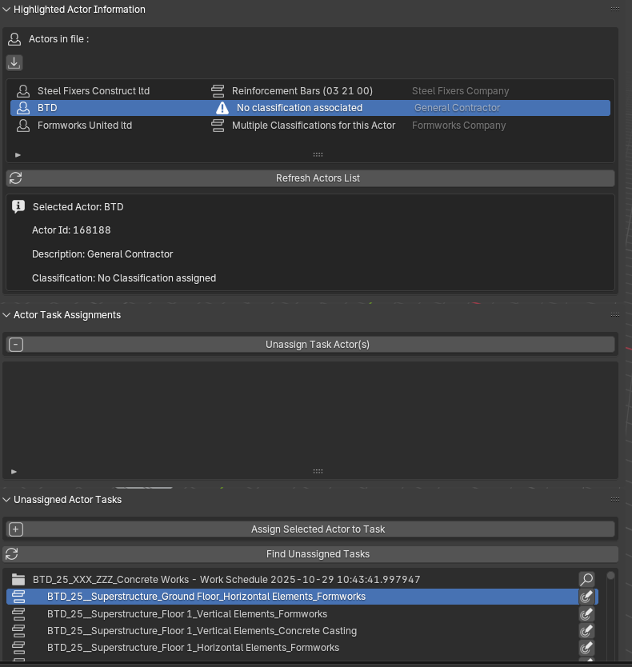

# Bonsai-Bim
Script and snippets for Blender Add-on BonsaiBIM
### BL_PNL_ACT_TASK_ACTOR_.py
---
  #### Shows:
  -  Actors in file
      -  List of existing actors in the file, along with their classification reference and Description
      -  Option to import Actors from a csv file and selectable option to Update the actors imported from the file vs the existing ones

  -   highlighted (selected) Actor info,
  -   Actor Classificaton,
  -   Actor Description
  -   ---
  -   Selected Actor Assigned tasks,
  -   Option to un assign actor from the selected task from within the panel
  -   Option to select the task in the sequence module \n(Opens the workschedule and selects the task)
  -   ---
  -   List of Actor unssigned tasks,
  -   Option to assign actor to the selected task from within the panel of unassigned tasks
  -   Option to select the task in the sequence module \n(Opens the workschedule and selects the task)

